<div align="center">

  <!-- ================= BANNER ================= -->
  

  <br/><br/>

  <!-- ================= TYPING EFFECT ================= -->
  <a href="https://github.com/xbernxxl">
    
  </a>

  <br/><br/>

  <!-- ================= BADGES & SOCIALS ================= -->
  <a href="https://linkedin.com/in/lino-sanchez" target="_blank">
    
  </a>
  &nbsp;
  <a href="https://github.com/xbernxxl" target="_blank">
    
  </a>
  &nbsp;
  <a href="mailto:lino.sanchez.bernal@gmail.com">
    
  </a>

</div>

<br/>

<!-- ================= WAVE DIVIDER ================= -->


---

## ⚡ Sobre Mí

Soy **Lino Enrique Sánchez**, Ingeniero de Software Full Stack apasionado por construir plataformas robustas, escalables y visualmente atractivas. Mi enfoque principal abarca el desarrollo de **APIs de alto rendimiento con FastAPI y Python**, interfaces reactivas modernas con **Vue 3 y Angular**, así como la integración avanzada de **Sistemas de Información Geográfica (GIS)** y soluciones de **Visión Artificial**.

Me especializo en transformar problemas complejos en arquitecturas modulares, limpias y listas para entornos de producción.

<br/>

<table width="100%">
  <tr>
    <td width="50%" valign="top">
      <h4>🎯 Propuesta de Valor</h4>
      <ul>
        <li><strong>Arquitectura Escalable:</strong> Diseño de backends orientados a microservicios con validaciones estrictas y respuesta de baja latencia.</li>
        <li><strong>Frontend Modular & Reactivo:</strong> Creación de interfaces componentizadas, fluidas y con foco en UX intuitiva y rendimiento.</li>
        <li><strong>Sistemas Espaciales (GIS):</strong> Procesamiento y renderizado en tiempo real de capas georreferenciadas y polígonos complejos.</li>
      </ul>
    </td>
    <td width="50%" valign="top">
      <h4>💡 Filosofía & Metodología</h4>
      <ul>
        <li><strong>Clean Code & Principios SOLID:</strong> Código legible, testeable y fácil de mantener a largo plazo.</li>
        <li><strong>Desarrollo Defensivo:</strong> Sanitización de entradas, control riguroso de errores y seguridad de extremo a extremo.</li>
        <li><strong>Contenedorización & Automatización:</strong> Entornos consistentes y listos para despliegue continuo mediante Docker.</li>
      </ul>
    </td>
  </tr>
</table>

```typescript
// 🚀 Developer Profile Object
const LinoSanchez = {
    title: "Full Stack Software Engineer",
    coreBackend: ["FastAPI", "Python", "Node.js", "Express"],
    coreFrontend: ["Vue 3 (Composition API / Pinia)", "Angular", "Tailwind CSS"],
    databases: ["PostgreSQL", "MySQL", "MariaDB", "SQLite"],
    specialties: ["Interactive GIS / Leaflet", "Computer Vision / Face-API.js", "Dockerized Environments"],
    motto: "< Write Clean • Build Resilient • Scale Fast />"
};
